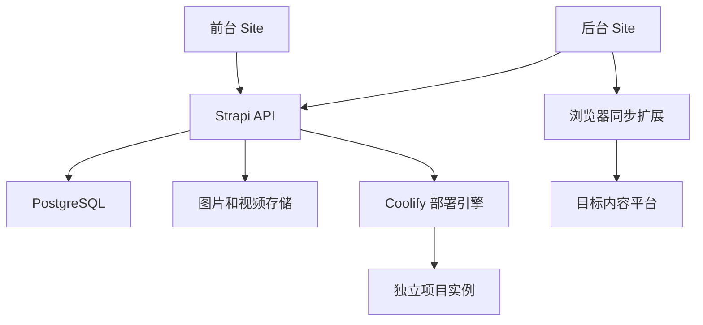

# 个人博客与项目作品集建设方案

方案版本：V1.1  
调研日期：2026-10-04  
当前状态：方案已确认，开源底座已取得；GitHub 仓库和网站尚未部署。

## 1. 产品定位与默认假设

把网站建设成自己的个人创作空间，统一承载文章、项目作品、在线演示和项目部署管理。

前台面向访客，提供阅读、发现、搜索和体验项目；后台面向本人，负责写作、媒体管理、多平台分发、项目部署和推荐设置。两者独立构建、独立发布，最终交付两个真实的 Sites 链接。

本方案按以下假设设计，后续可调整：

- 单人维护，以中文内容为主，移动端和桌面端都能完整使用。
- 前台正式上线时面向访客公开；后台仅本人可用。
- 文章以 Markdown 源文为权威内容。
- 首批分发平台确定为知乎、掘金、CSDN、小红书；微信公众号根据账号能力接入。平台分别维护草稿与正式发布能力。
- 项目既包含纯前端演示，也包含需要 Node、Python 或 Docker 服务的应用。
- 后端 API、数据库和部署引擎可以部署在独立服务器或支持 Node/Docker 的托管环境；两个浏览入口使用 Sites。

## 2. GitHub 开源项目调研与取舍

### 2.1 推荐改造底座

[PictureElement/nextjs-strapi-portfolio-starter](https://github.com/PictureElement/nextjs-strapi-portfolio-starter)

该项目提供独立的 Next.js 前端目录和 Strapi 后端目录，已经有博客、项目列表与详情、首页内容管理、SEO 和站点地图等基础功能，代码采用 MIT 许可证。调研时仓库未归档；GitHub 返回的最近推送时间为 2026-09-25。

采用方式：保留博客/项目内容模型、前后端 API 分工和 SEO 基础，重新设计前台页面与交互，并增加下表中的业务模块。原项目是一个改造起点，其 README 中的性能表现不作为本项目的验收结果。

| 模块 | 可复用基础 | 需要新增或重做的内容 |
| --- | --- | --- |
| 文章 | 博客列表、详情、CMS 内容管理 | 更完整的 Markdown 编辑、可移植导入导出、草稿恢复、修订快照 |
| 作品集 | 项目列表、详情、精选项目 | 在线演示、运行状态、项目与文章关联、部署工作台 |
| 首页 | 首页模块和内容管理 | 独特布局、文章与项目的混合推荐、推荐解释 |
| 多平台 | 不具备完整分发模块 | 分发适配器、登录检查、格式转换、逐平台任务记录 |
| 视觉与动画 | Tailwind 和现有页面结构 | 个人视觉系统、Motion 动画、响应式与性能优化 |
| 后台 | Strapi 管理、媒体与 API | 写作工作区、推荐设置、部署控制、同步任务页 |

实现前核对模板依赖，升级到经过验证的安全版本，统一 Strapi 及其插件版本，并锁定依赖。Sites 部署时按支持的运行时适配前端，验证 SSR、缓存、资源和路由，不假定原有 Next.js 服务可以直接原样运行。

### 2.2 其他候选

| 项目 | 适合的用途 | 本方案中的取舍 |
| --- | --- | --- |
| [halo-dev/halo](https://github.com/halo-dev/halo) | 博客、内容管理、插件扩展 | 可作为偏重传统博客管理的备选；若采用，还需增加独立作品集前端和部署工作台 |
| [TryGhost/Ghost](https://github.com/TryGhost/Ghost) | 专业内容发布、订阅、Headless 内容 API | 作为重视文章和订阅的备选；项目模型、完整 Markdown 包往返和部署工作台需要扩展 |
| [Innei/Shiro](https://github.com/Innei/Shiro) | 个人站点视觉、弹性动画、文章与手记 | 借鉴设计与交互。当前 README 明确进入维护模式，且只兼容 Mix Space Core 10.x |
| [mx-space/core](https://github.com/mx-space/core) | 个人内容网站的 Headless CMS | 当前架构已演进至 NestJS、PostgreSQL、Redis 等；与旧 Shiro 不能直接拼接，需核对前端和版本兼容性 |
| [saicaca/fuwari](https://github.com/saicaca/fuwari) | Astro 静态博客、Markdown、页面过渡 | 可作阅读界面参考；本需求还需要单独的写作后台和项目部署系统 |

选型判断基于本需求的改造量、前后台分工和后续维护，不按累计 Star 排名。

## 3. 技术架构与两个 Sites 入口

### 3.1 推荐部署结构

| 部署单元 | 职责 | 部署位置 |
| --- | --- | --- |
| 前台 Site | 首页、文章、作品集、演示入口、搜索 | 独立 Sites 项目 |
| 后台 Site | 写作、媒体、分发、项目、推荐、站点设置 | 另一个独立 Sites 项目，限制访问 |
| Strapi API | 内容持久化、权限、推荐接口、任务与部署适配 | 独立 Node/Docker 环境 |
| PostgreSQL | 文章、项目、关系、修订、任务、统计 | 后端数据库 |
| 对象存储 | 图片、视频、附件、导出包 | S3 兼容存储，如 R2 或云对象存储 |
| Coolify | 构建和运行需要服务器的个人项目 | 独立服务器上的部署引擎 |
| 同步扩展 | 使用本人的目标平台登录状态执行分发 | 本人浏览器；远程模式需要可用的在线连接 |

两个 Sites 链接对应两个完整页面入口。后台管理页、API 服务和数据库是不同的部署职责。Strapi 官方支持将管理页面和 API 部署在不同服务器；管理页构建时配置 API 地址，后端可以关闭静态管理页服务。

Sites 目前的托管服务运行在 Cloudflare Workers 环境，不能直接原样启动 Strapi Node 服务、Docker 容器或任意 Python 项目。若后续要求所有后端逻辑也只在 Sites 内运行，需要改成 Worker API + D1 + R2，并重做对应的内容后台；这会改变当前推荐的 Strapi 方案和工作量。

### 3.2 前后台调用原则

- 前台只访问公开且已发布内容；私有项目、草稿和修订记录不进入公开接口、搜索索引或推荐池。
- 后台 Sites 的访问限制与 API 的作者鉴权共同生效；不能只隐藏后台页面而让写接口公开。
- 跨域配置仅允许需要的前台、后台来源；部署和对象存储密钥保留在服务端。
- 内容发布后触发前台缓存刷新；读取失败时展示已缓存内容和明确状态。
- 代码可以放在一个仓库内，共享类型、设计规范和 Markdown 渲染模块；前台、后台、API 各有独立构建和部署流程。

## 4. Markdown 写作、媒体与导入导出

### 4.1 写作工作区

基于 Strapi 的原生 Markdown 字段和编辑功能扩展写作界面：

- Markdown 源码、实时预览、分屏和专注模式。
- 标题、摘要、封面、分类、标签、系列、关联项目。
- 表格、任务列表、代码高亮、脚注、提示块；公式和 Mermaid 图通过受控扩展渲染。
- 自动保存、保存状态、离线临时恢复、服务端修订快照。
- 草稿、发布、撤回、预约发布；预约任务由后端定时任务模块实现。
- 手机可以编辑和上传媒体，桌面端提供快捷键。

正文权威字段为 `body_markdown`，HTML 为渲染结果，不能代替源文。富媒体节点要有可序列化的 Markdown 扩展表示；禁止执行文章中的任意脚本或任意 MDX 代码。

Strapi 原生支持 Markdown 编辑与预览，但文章级 Markdown 文件导入导出、自动保存和修订快照仍需按需求开发。其原生 Content History、Releases 等部分能力属于付费方案；本方案中的个人修订快照和预约发布按自定义模块实现，不将其视为免费版现成功能。

### 4.2 图片与视频

| 内容 | 编辑行为 | 前台展示与迁移 |
| --- | --- | --- |
| 图片 | 粘贴、拖拽、上传、从媒体库选择，填写说明和替代文本 | 响应式尺寸、懒加载、灯箱；导出时保留本地资源 |
| 本地视频 | 上传 MP4 等约定格式，设置封面和说明 | 原生播放器、手动播放、按需加载；文件存入对象存储 |
| 平台视频 | 粘贴支持的平台链接，通过受控视频节点插入 | 白名单嵌入；平台禁止嵌入时提供封面和打开链接 |
| 附件 | 上传 PDF、ZIP 等允许的格式 | 下载入口；区分公开资源和私人资源 |

大文件采用直传对象存储、分片或可恢复上传，避免经过页面运行时进行长时间处理。生成视频封面或转码时使用独立任务执行环境。

### 4.3 可移植导入导出

| 功能 | 格式与行为 |
| --- | --- |
| 单篇导入 | `.md` + YAML Front Matter，预览元信息后导入为草稿 |
| 批量导入 | ZIP 内的 Markdown、相对路径资源及清单，返回逐篇结果 |
| 单篇导出 | Markdown、Front Matter、图片/视频/附件组成的 ZIP |
| 全站内容导出 | 文章、项目说明、分类标签、资源清单及资源文件，带格式版本号 |
| 平台兼容导出 | 生成适配目标平台的 Markdown 或 HTML；不支持的交互节点转为封面与链接 |
| 恢复与去重 | 按稳定 ID、slug 和内容哈希检测重复，支持新建、跳过和明确覆盖 |

重要要求：导出包可以重新导入新实例，标题、正文、分类、文章与项目关系、图片和视频仍能正确使用。媒体不能只依赖旧域名上的外链。

文章内容导出与数据库灾备分开实现。数据库备份、对象存储版本和部署配置备份共同构成完整恢复能力。

## 5. 一键多平台分发

### 5.1 优先复用的项目

[wechatsync/Wechatsync](https://github.com/wechatsync/Wechatsync)

该项目提供浏览器扩展、CLI 和 MCP 集成；README 还给出通过网页端 `article-syncjs` SDK 调起同步任务的方式。优先通过扩展和适配接口接入，保留相应开源许可证和来源声明。

关键限制：其 `sync_article` 文档明确描述为同步到草稿。平台是否允许自动正式发布、是否要求人工补充封面/分类、是否支持更新或撤回，需逐平台核对并实测。博客后台必须展示准确结果，不能把写入平台草稿显示成正式发布成功。

### 5.2 使用流程

1. 在后台完成文章，选择“发布到本站”与分发目标。
2. 检查已登录账号、标题长度、封面、标签和富媒体兼容性。
3. 固定本次正文版本，为每个平台生成适配内容。
4. 一次提交多个分发任务，逐平台执行并反馈。
5. 可正式发布的适配器记录正式 URL；仅支持草稿的平台记录草稿 URL 和下一步操作。
6. 修改文章后，保留旧分发记录，再创建针对新版本的同步任务。

### 5.3 状态和可靠性

- 任务状态：待处理、执行中、已存草稿、已正式发布、需要补充信息、登录失效、失败。
- 任务键使用文章 ID、修订 ID、平台和目标账号，避免重复点击生成重复文章。
- 一个目标失败不会撤销其他目标的成功结果；失败项可以单独重试。
- 支持不同平台的标题、简介、封面与标签覆盖，同时保留统一源文。
- 图片上传到目标平台或生成可使用的媒体版本；代码、表格和公式需转换；交互项目与不兼容视频降级成封面和链接。
- 浏览器模式依赖在线浏览器和有效登录状态；电脑离线时，任务显示等待连接。要实现无人值守，需要额外的常驻授权浏览器或平台正式 API 通路。
- 后端保存任务结果；浏览器扩展执行后的状态回传、SDK 兼容性和队列对接属于集成开发范围。

首批平台完成验收后再扩大范围，形成 `支持登录检查 / 草稿 / 正式发布 / 更新 / 撤回 / 视频` 的平台能力矩阵。

### 5.4 小红书适配

小红书纳入首批平台，平台 ID 为 `xiaohongshu`。优先复用 Wechatsync 的长文笔记草稿同步和 ProseMirror 内容转换；正文、图片和封面按目标模式处理。后台准确显示“长文草稿已生成”，不将草稿同步标记为正式发布。

图文笔记和视频笔记维护独立能力与适配通路，不默认与长文使用同一套字段或接口。需要扩展时评估 [xpzouying/xiaohongshu-mcp](https://github.com/xpzouying/xiaohongshu-mcp)，并通过本人登录账号进行发布验收。

能力依据：[Wechatsync CHANGELOG](https://github.com/wechatsync/Wechatsync/blob/v2/CHANGELOG.md) 与 [ROADMAP](https://github.com/wechatsync/Wechatsync/blob/v2/packages/extension/ROADMAP.md)。

## 6. 个人项目集与部署工作台

### 6.1 前台作品集

每个项目有独立详情页：项目介绍、解决的问题、截图与视频、在线演示、GitHub 链接、技术栈、状态、更新时间、版本和相关文章。

文章与项目支持多对多关联。访客读完一篇实现过程，可以进入项目体验；看完项目，也能继续读背后的设计与复盘。

项目支持公开演示、私人入口、已归档等状态。外部项目禁止 iframe 时，以独立入口打开。支持嵌入的项目应有明确的来源与权限配置，项目数据和主站会话分别管理。

### 6.2 后台部署工作台

优先复用 [coollabsio/coolify](https://github.com/coollabsio/coolify) 作为项目部署引擎。其 API 可以管理项目、应用与部署，支持从 Git 仓库、Dockerfile、Docker Compose 或镜像部署应用。

| 功能 | 后台行为 |
| --- | --- |
| 新建项目 | 填写项目内容，绑定 GitHub 仓库、分支、部署环境和域名 |
| 接入已有项目 | 录入既有演示 URL，关联已部署实例，检测访问状态 |
| 部署项目 | 后端调用部署引擎构建和启动独立应用 |
| 自动更新 | 在支持的项目上配置 Git push 触发构建与部署 |
| 查看状态 | 展示排队、构建、运行、失败状态与脱敏日志 |
| 版本与回退 | 保存部署版本，使用引擎保留的可回退版本恢复 |
| 环境配置 | 管理构建命令、运行端口和环境变量；密钥只在服务端使用 |
| 作品管理 | 部署成功后更新演示 URL，可决定是否展示和推荐 |

支持的首批项目类型建议为静态前端和 Docker 应用；Node/Python 项目通过约定构建方式或 Dockerfile 接入。不同项目独立运行，资源和数据各自管理，避免一个项目部署失败影响主站。

“项目后台点部署”表示调用实际托管引擎构建和运行项目。后台操作页本身不会把任意应用运行在同一个网页进程里。首版至少验收一个静态项目与一个带后端的示例应用。

## 7. 首页推荐与相关内容算法

### 7.1 首页结构

首页包含个人身份和近期动态、代表项目、精选文章、最新内容与探索内容。页面由可配置模块构成，后台能调整顺序和显示范围。

推荐对象统一包含文章与项目。后台选择重点内容、置顶位置、推荐有效期和目标主题。推荐池只包含已发布、公开、允许推荐的记录。

### 7.2 首版评分

置顶内容先占指定位置，剩余位置再评分；置顶也需符合公开与发布状态限制。

建议起始权重如下，属于本项目设计建议，可在后台调整，不是经过流量实验验证的最佳权重。

| 因素 | 建议权重 | 定义 |
| --- | --- | --- |
| 作者精选强度 | 30% | 作者在后台标记的展示优先级，归一化到 0–1 |
| 内容完成度 | 25% | 文章结构与媒体完整度、项目说明与有效演示等规则得分 |
| 新鲜度 | 20% | 发布时间或有实质变化的更新时间按时间衰减 |
| 有效互动 | 15% | 经平滑的阅读完成、项目打开、点赞收藏等信号 |
| 主题相关性 | 10% | 访客主动选择的主题或当前阅读上下文匹配程度 |

`score = 0.30 × editorial + 0.25 × completeness + 0.20 × freshness + 0.15 × engagement + 0.10 × relevance`

每一项先归一化。流量不足时，互动使用站点先验值；新访客没有主题偏好时，相关性使用默认值。新内容不因没有访问数据自动垫底。长期维护的项目与文章使用不同的新鲜度衰减周期。

完成度只代表可明确检查的结构完整程度，不等同于观点质量；观点与代表性主要由作者精选决定。

### 7.3 排序约束与推荐解释

- 文章与项目分别设置配额，再合并排序，避免文章数量压过作品展示。
- 探索推荐预留约 10%–20% 的位置，在合格新内容或长尾内容中选择。
- 控制相同主题的连续曝光，避免一页全是同一类型。
- 区分内容类型、有效曝光和阅读/体验行为，不直接混用文章与项目的原始点击量。
- 过滤重复和明显机器流量；有足够样本后才提高互动信号影响。
- 在本次访问中维持顺序稳定，不因即时计数变化让页面跳动。
- 返回“作者精选”“近期更新”“与你选择的自动化主题相关”等推荐理由。
- 后台提供权重预览、某条内容的得分分解与排除原因。

### 7.4 文章后的推荐

先推荐直接关联的项目与同系列文章，再按标签重合度、摘要相似性和作者指定关系排序。内容较多时可加入向量检索；大模型可辅助生成摘要、标签或分类，首页请求不必逐次调用大模型。

### 7.5 观察指标

记录有效曝光、文章打开、有效阅读、关联项目打开、演示访问和回访等指标。只收集推荐所需的最小信息；访客不需要登录就能获得基础推荐。数据稀少时，在后台保留清楚的样本量提示，先以作者控制与内容规则为主。

## 8. UI 与动画技能选型

以下项目用于开发阶段的设计与实现指导；实际网站使用页面代码、CSS 和动画库运行。

| GitHub 项目 | 用途 | 本项目的使用位置 |
| --- | --- | --- |
| [anthropics/skills 的 frontend-design](https://github.com/anthropics/skills/tree/main/skills/frontend-design) | 视觉方向、字体、排版与有辨识度的设计 | 前台视觉规范、首页和作品页构图 |
| [Leonxlnx/taste-skill](https://github.com/Leonxlnx/taste-skill) | 布局变化、个性化与动效强度指导 | 私人工作室的界面细节与布局审查 |
| [nextlevelbuilder/ui-ux-pro-max-skill](https://github.com/nextlevelbuilder/ui-ux-pro-max-skill) | 配色、字体、交互与无障碍规范 | 响应式、状态反馈和基础可用性检查 |
| [emilkowalski/skills](https://github.com/emilkowalski/skills) | 动画曲线、时长、弹性、审查和改进 | 导航、展开、筛选和页面切换 |
| [motiondivision/ai-kit](https://github.com/motiondivision/ai-kit) 与 [Motion](https://github.com/motiondivision/motion) | 动画 API 指导及实际动画库 | React 动画实现、布局过渡和手势 |

以产品视觉规范为主约束，按任务选择技能，避免不同技能各自引入不一致的页面风格。

### 8.1 推荐视觉方向：私人创作实验室

首页像自己的创作桌：代表项目以可点击的作品对象展示，文章以笔记与专题入口出现，个人标记和真实项目截图形成识别点。

- 采用明确的主色与辅助色，如钴蓝、珊瑚红和亮黄色；背景与长文区域保持清晰可读。配色是候选设计方向，需在视觉稿阶段检查对比度。
- 具有个人特征的签名、文字和图形元素贯穿首页、项目页面和导航。
- 使用非对称但有秩序的桌面布局；重点项目具有更大的视觉面积。
- 长文页面保留安静的排版、清楚的目录与舒适行距。
- 项目筛选可像切换桌面上的作品，点击时过渡到项目详情；移动端按明确顺序排列，功能不依赖悬停。
- 后台延续颜色与标识，以编辑效率、信息清晰和任务状态为核心。

另外两种可比较的方向是“数字手账”，突出个人记录、时间线和纸张层次；以及“彩色几何作品馆”，突出作品视觉、形状和大面积色块。开发前用同一份真实内容制作视觉稿，比较首页、项目集和文章详情，再固定方向。

### 8.2 动画与性能目标

| 位置 | 动效建议 |
| --- | --- |
| 首页 | 一次有编排的入场，突出身份与代表作品 |
| 项目筛选 | 布局过渡，保持目标位置与阅读连续性 |
| 详情打开 | 封面或作品对象与详情的连续过渡 |
| 目录和导航 | 轻量展开、当前阅读位置反馈 |
| 写作与部署 | 保存、上传和任务进度的清楚反馈 |

- 优先动画 `transform`、`opacity` 等适合合成的属性，减少大面积重排与持续重绘。
- 媒体按需加载，视频展示封面后再加载，不默认有声播放。
- 重型场景延后加载，后台和正文不依赖装饰动画才能工作。
- 保留原生滚动、键盘操作和系统减少动画偏好；移动端有适当降级。
- 约定测试设备和网络后，以动画接近稳定 60fps、移动端 LCP ≤ 2.5 秒、INP ≤ 200ms、CLS ≤ 0.1 为目标；最终以实际页面测试为准。
- 验证加载中、空内容、媒体失败、任务失败和低性能设备上的表现。

## 9. 后台模块与核心数据

### 9.1 后台菜单

| 模块 | 操作 |
| --- | --- |
| 总览 | 草稿、最近发布、部署与分发任务、访问概况 |
| 写作 | 文章、系列、标签、修订快照、预约发布、导入导出 |
| 媒体 | 图片、视频、附件、使用位置与存储概况 |
| 项目 | 项目说明、仓库、演示、部署、日志、回退版本 |
| 分发 | 平台能力、登录状态、稿件适配、逐平台执行结果 |
| 推荐 | 首页模块、置顶、有效期、权重、预览与推荐解释 |
| 站点 | 个人信息、导航、主题、SEO、RSS、备份与访问权限 |

### 9.2 核心实体

| 实体 | 主要信息 |
| --- | --- |
| Article | ID、slug、标题、摘要、Markdown、封面、发布状态、时间、推荐设置 |
| ArticleRevision | 文章、修订序号、Markdown、元信息、内容哈希、作者、时间 |
| Project | ID、slug、介绍、媒体、类型、仓库、演示 URL、可见性、状态 |
| ArticleProject | 文章与项目的关联关系、关系类型和顺序 |
| MediaAsset | 对象键、类型、大小、尺寸、描述、可见性和引用位置 |
| Deployment | 项目、引擎资源 ID、Git 版本、状态、日志引用、可回退版本 |
| DistributionTask | 文章修订、平台、账号、状态、幂等键、平台 URL、失败原因 |
| RecommendationSettings | 模块、置顶与有效期、因子权重、类型配额、探索比例 |
| ContentSignals | 内容、日期、有效曝光、阅读/演示信号、去重后的统计 |

数据模型按业务关系扩展，复用 Strapi 的内容类型和插件机制。公开内容接口、作者编辑接口与部署控制接口分别授权。

## 10. 建议补充的功能

首版一起考虑：

- 站内中文搜索，文章与项目统一结果；标签、分类、系列和归档。
- SEO 标题、摘要、分享卡片、站点地图、RSS 和稳定 slug。
- 修改链接时保留重定向，文章与项目分享地址长期可用。
- 草稿恢复、修订快照、全站内容导出与备份恢复。
- 公开项目与私人项目的权限区分，公开演示独立使用示例数据。
- 推荐和部署操作有明确状态、错误说明和日志。
- 日间/夜间主题、字体加载优化、手机阅读与编辑。

后续可增加评论或留言、邮件订阅、内容双语版本，以及 AI 摘要、标签和整理工具。可提供 CLI/MCP，让 Codex 或 OpenCode 创建草稿、读取项目状态和执行作者授权的操作；这些工具复用现有 API 与权限。

## 11. 实施阶段与验收

| 阶段 | 主要交付 |
| --- | --- |
| 视觉与架构 | 固定改造版本、数据关系、API 与部署边界，完成前台首页/作品集/后台写作界面的视觉稿 |
| 内容与后台 | 真正可保存的文章与项目，Markdown 编辑、媒体、修订、导入导出、搜索与权限 |
| 分发与项目运行 | 首批平台的实测分发、逐平台状态、部署引擎接入、静态与带后端的项目演示 |
| 推荐与上线 | 可解释推荐、后台调权重、动效与响应式优化、功能和恢复验证、两个独立 Sites 链接 |

功能验收至少包括：

1. 文章保存后刷新与换设备仍存在，草稿不会出现在公开列表、搜索和推荐中。
2. Markdown、表格、图片、视频与约定扩展在编辑预览和前台显示一致。
3. 从实例 A 导出内容与资源，在实例 B 导入后可正确阅读；重复导入有明确处理结果。
4. 至少两家首批平台分发成功，明确区分草稿与正式发布；登录失效和部分失败可独立处理。
5. 在后台实际部署一个静态应用和一个带后端的应用，部署成功后可体验；失败时展示真实日志。
6. 推荐排除私有和撤回内容，置顶生效，新内容有曝光，后台可解释排序。
7. 未授权请求不能编辑文章、读取草稿或触发部署。
8. 前后台分别构建、部署和访问，手机可阅读、搜索并执行核心后台操作。
9. 动画与性能在约定设备上实测，减少动画设置生效。
10. 完成一次内容与媒体恢复验证，交付源代码、部署说明与两个真实 Sites 链接。

完整上线依赖 API 运行环境、对象存储、部署引擎访问和本人目标平台登录授权。阶段交付中会明确连接情况；未连接的发布或部署适配器不得显示为已经可用。

## 12. GitHub 仓库与提交、回退约定

用户已要求在 `fsan10` 账号中新建公开仓库。拟定仓库名为 `personal-creative-space`，实际创建结果以 GitHub 返回为准。现有项目仓库不用于本项目。

- 每完成一个独立功能，或到达需求确认、工程初始化、数据结构、集成、验收、部署等关键节点，单独创建提交。
- 提交后立即推送到 GitHub；远程暂时不可用时记录本地提交及未推送状态，恢复后按原有提交顺序同步。
- 功能较大时按可运行、可验证的小步拆分，不把整个项目压成一个最终提交。
- 消息使用 `feat`、`fix`、`docs`、`refactor`、`chore` 等前缀，写清功能或修复点。
- 已验证的关键节点创建 `checkpoint-001-*` 等带编号的标签；完成正式部署后再创建版本标签。
- 维护功能与提交、标签、验证结果的对应记录，方便指定需要回退的部分。
- 撤销某个功能优先使用 `git revert` 生成新提交并推送；保留原有历史。对有依赖的后续功能同时评估影响。
- 不用强制推送或改写已推送历史来替代正常回退；代码回退与数据库迁移、媒体和生产数据恢复分别处理。
- 公开仓库不提交平台 Cookie、Token、密码、生产环境配置、个人媒体或真实业务数据；只提交占位配置与示例数据。

## 13. 调研来源

- [推荐模板与 README](https://github.com/PictureElement/nextjs-strapi-portfolio-starter)
- [推荐模板仓库元信息](https://api.github.com/repos/PictureElement/nextjs-strapi-portfolio-starter)
- [推荐模板前端依赖](https://github.com/PictureElement/nextjs-strapi-portfolio-starter/blob/main/next/package.json)
- [推荐模板 Strapi 依赖](https://github.com/PictureElement/nextjs-strapi-portfolio-starter/blob/main/strapi/package.json)
- [Strapi Markdown 内容编辑](https://docs.strapi.io/cms/features/content-manager)
- [Strapi 管理页与 API 分离配置](https://docs.strapi.io/cms/configurations/admin-panel)
- [Strapi 数据导入导出](https://docs.strapi.io/cms/features/data-management)
- [Strapi Content History](https://docs.strapi.io/cms/features/content-history)
- [Strapi Releases](https://docs.strapi.io/cms/features/releases)
- [Ghost 内容 API](https://ghost.org/docs/content-api/)
- [Ghost 数据导出](https://ghost.org/help/exports/)
- [Halo](https://github.com/halo-dev/halo)
- [Shiro 兼容性与维护状态](https://github.com/Innei/Shiro)
- [Mix Space 当前架构](https://github.com/mx-space/core)
- [Fuwari](https://github.com/saicaca/fuwari)
- [Wechatsync](https://github.com/wechatsync/Wechatsync)
- [Wechatsync CLI 与浏览器连接](https://github.com/wechatsync/Wechatsync/blob/v2/packages/cli/README.md)
- [Wechatsync 根许可证](https://github.com/wechatsync/Wechatsync/blob/v2/LICENSE)
- [Coolify](https://github.com/coollabsio/coolify)
- [Coolify API](https://coolify.io/docs/api/overview)
- [Coolify 部署状态与方式](https://coolify.io/docs/applications/deployments/overview)
- [frontend-design](https://github.com/anthropics/skills/tree/main/skills/frontend-design)
- [Taste Skill](https://github.com/Leonxlnx/taste-skill)
- [UI UX Pro Max Skill](https://github.com/nextlevelbuilder/ui-ux-pro-max-skill)
- [Emil Kowalski Skills](https://github.com/emilkowalski/skills)
- [Motion](https://github.com/motiondivision/motion)
- [Motion AI Kit](https://github.com/motiondivision/ai-kit)

Sites 的部署边界依据本次读取的官方 Sites 技能与运行时说明。以上开源仓库的状态、接口和版本在实施时需要按选定提交再次核对。